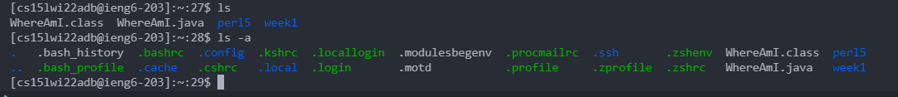

# Week 2 Lab Report by Daniel Lee

## Installing VScode


* Download VS Code from [here](https://code.visualstudio.com/download)
* Install your OS version and follow the installer instructions

## Remotely Connecting

* Make sure to [install OpenSSH](https://docs.microsoft.com/en-us/windows-server/administration/openssh/openssh_install_firstuse)
* Open a terminal through VScode (new -> terminal) or the command prompt/powershell on windows
* Type in the following command, continue connecting (yes), and then enter your password for your TritonLink account
```
$ ssh cs15lwi22<insert course specific letters>@ieng6.ucsd.edu
```
* When you are connected to the server the terminal should look like the screnshot below


* to look up the letters for your account, use this [link](https://sdacs.ucsd.edu/~icc/index.php)
* you may need to change your password in tritonlink before you can connect to the server

## Trying Some Commands

* You can try using different commands
```
ls // lists visible files in directory
cd <directory> // changes current directory
ls <directory> // lists everything in directory
ls -a // lists everything in current directory
cp <path to file> <directory> // copies file to directory path
cat <path to file> // prints out data from file
exit // logs out of server
```
* An example of using ls and ls -a


## Moving Files with scp

* The scp command copies a file from your local computer to the server
```
$scp <filename> <username>:~/
```
* The command will prompt you to login, and when you login to the server again and use ls you should see the file in the home directory of the server
* Below is an example screenshot of copying a file from the local computer to the server


## Setting an SSH Key

* Follow the steps on this [link](https://docs.microsoft.com/en-us/windows-server/administration/openssh/openssh_keymanagement#user-key-generation) to generate an SSH key. Generating the key should look like this:


* This is so you don't have to enter your password every time you connect to the server
* Windows users: follow the steps up to the ssh-agent commands, other OS users do not need the ssh-agent steps
* After, login to the server and type this command
```
$ mkdir .ssh
```
* Logout, and on the client type in this command
```
$ scp <key path> <username>:~/.ssh/authorized_keys
```

## Optimizing Remote Running

* There are certain commands you can use to make remote running even faster
* For example, writing a command after logging into the server automatically runs it
```
ssh <username> "<command>"
```
* You can use a semicolon to separate multiple commands in the terminal
```
cd <directory>; ls -a;
```
* Below is an example of multiple commands running on the server
