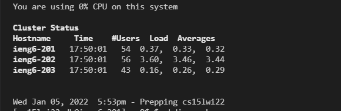

# Week 2 Lab Report by Daniel Lee

## Installing VScode

* download VS Code from [here](https://code.visualstudio.com/download)
* install your OS version and follow the installer instructions

## Remotely Connecting

## Trying Some Commands

## Moving Files with scp

## Setting an SSH Key

## Optimizing Remote Running

