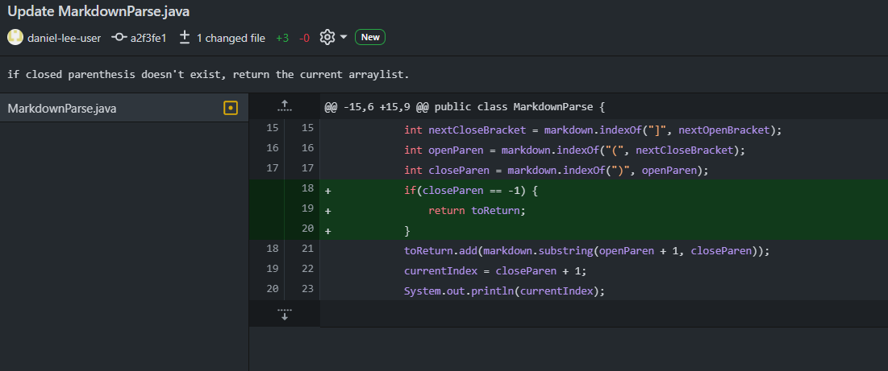
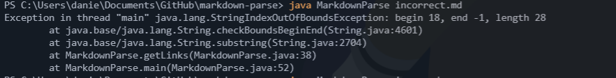
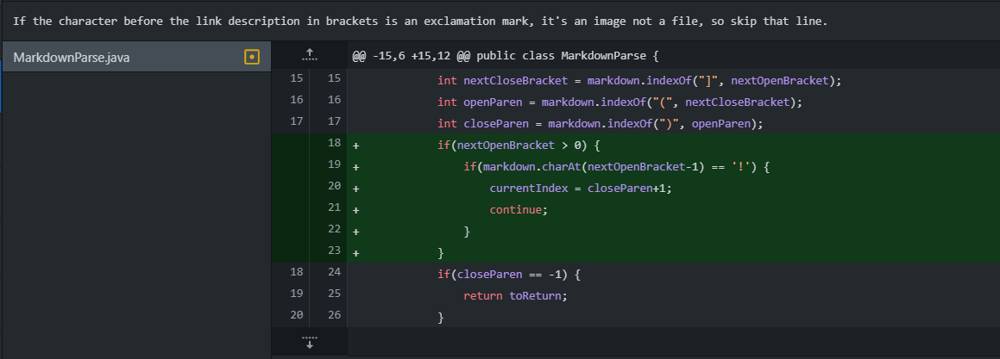
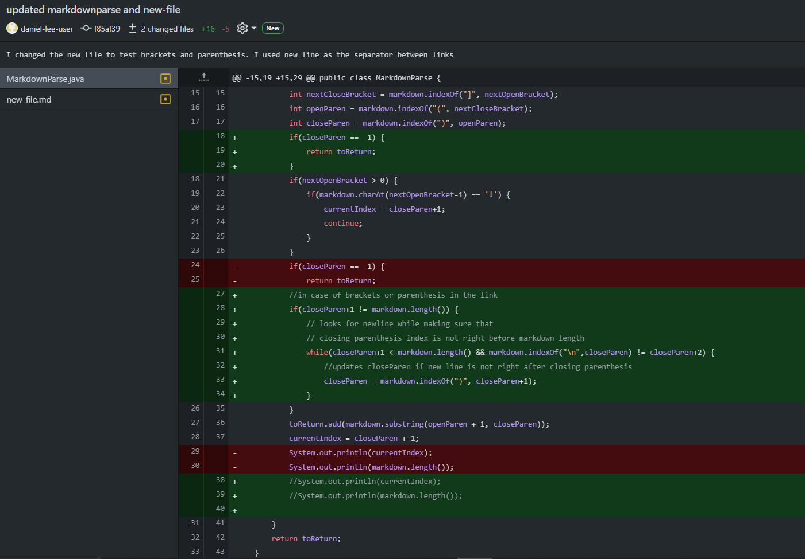
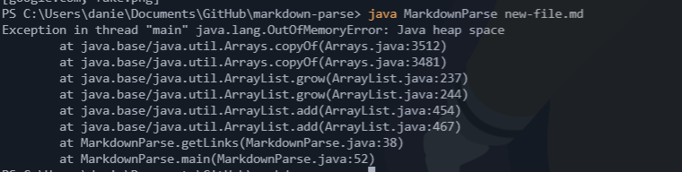

# Week 4 Lab Report by Daniel Lee

## Code Change Difference 1: No Ending Parenthesis

[Here](input_fail_files/incorrect.html) is the link to the failure inducing input test file for code difference 1.

Output of error #1:

This bug was caused by the programmer not accounting for the failure inducing input to give no ending parenthesis after a starting parenthesis.

The symptoms of this bug outputted a string out of bounds exception as the links method tried to get the substring of the markdown string from the open parenthesis to -1.

This is because the closing parenthesis index equals -1 because closing parenthesis doesn't exist in the string after open parenthesis.

## Code Change Difference 2: Image vs Link

[Here](input_fail_files/image.html) is the link to the failure inducing input test file for code difference 2.

Output of error #2:

This bug was caused by the programmer not treating links and images differently, as images have an exclamation mark before the brackets and links don't in markdown texts.

The symptom of this bug was that the image file would be treated as a link and included in the arraylist that was printed out at the end.

The failure inducing input had an exclamation mark before the square bracket, but the starter code did not look for this input in particular. 

## Code Change Difference 3: Brackets/Parenthesis In Link

[Here](input_fail_files/new-file.html) is the link to the failure inducing input test file for code difference 2.

Output of error #3:

The bug was caused by the programmer not including an exception for when there are parenthesis or brackets in the link, so the link would be cut short.

The symptom of this bug was that the code would run in an endless loop when the link had parenthesis or brackets in it.

Close parenthesis or brackets in the link caused this because the code searches for those key characters to separate the links.