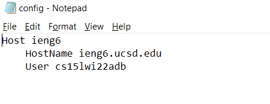
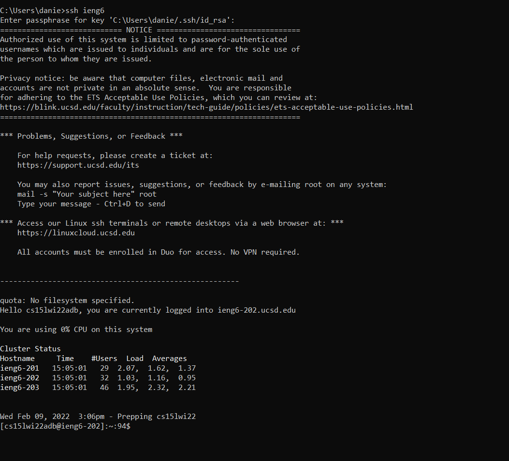

# Week 6 Lab Report by Daniel Lee

## Streaming ssh Configuration

### **.ssh config file**

This config file was edited using notepad. I copied the lines from the week 5 lab.

###  **.ssh login**

I used command prompt to login to the ieng6 server. I used the ieng6 identity I created in the config.

### **SCP command** 

I used scp to copy a test java file to the ieng6 server.