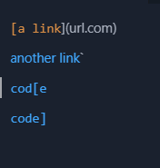
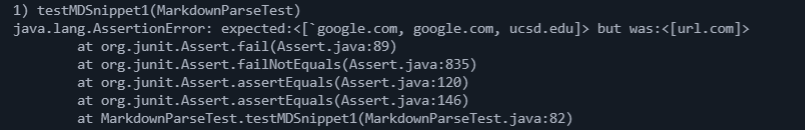
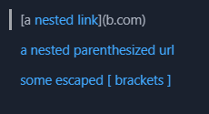
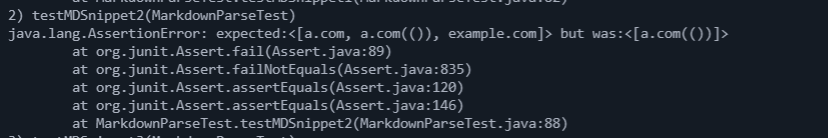
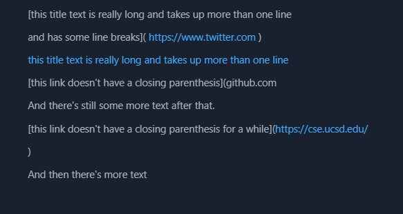
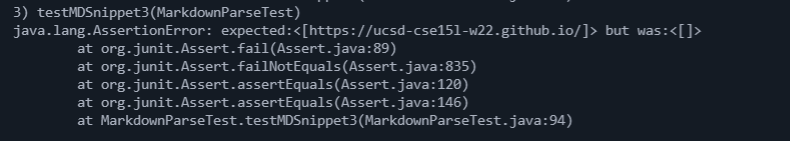

# Week 8 Lab Report by Daniel Lee

[my markdown-parse repo](https://github.com/daniel-lee-user/markdown-parse)

## Markdown Parse Snippet 1

Using the vscode preview for mdsnippet1 I decided that the last three links (`google.com, google.com, and ucsd.edu) should be recognized as valid links. url.com should not be recognized as a valid link.

Here is what the built in VSCode preview showed:



Here is the test I implemented for both my implementation and the repo I reviewed:

```
@Test
public void testMDSnippet1() throws IOException {
    String filename = "mdsnippet1.md";
    ArrayList<String> links = 
        MarkdownParse.getLinks(Files.readString(Path.of(filename)));
    assertEquals(List.of("`google.com","google.com", "ucsd.edu"), links);
}
```



I think there is a small code change I can make that would make my program work for snippet 1 and all related cases that use inline code with backticks. I could change the code regarding the link itself (inside the parenthesis to ignore all backticks. I would also change the code checking the character before the opening bracket. I would  make sure that if there is at least one backtick before the opening bracket and a backtick after it the url would be skipped.

## Markdown Parse Snippet 2

Using the vscode preview for mdsnippet2 I decided that three links (a.com, a.com(()), and example.com) should be recognized as valid links. b.com should not be recognized as a valid link.

Here is what the built in VSCode preview showed:



Here is the test I implemented for both my implementation and the repo I reviewed:

```
@Test
    public void testMDSnippet2() throws IOException {
        String filename = "mdsnippet2.md";
        ArrayList<String> links = 
            MarkdownParse.getLinks(Files.readString(Path.of(filename)));
        assertEquals(List.of("a.com","a.com(())", "example.com"), links);
    }
```



I do not think there is a small code change that will make my program work for snippet 2 and all related cases that nest parentheses, brackets, and escaped brackets. I would have to implement a lot of helper methods that would check for nested links within nested links. There are too many cases to account for when checking for extra brackets, extra parenthesis, and nested links.

## Markdown Parse Snippet 3

Using the vscode preview for mdsnippet3 I decided that only one link (https://ucsd-cse15l-w22.github.io/) should be recognized as a valid link. https://www.twitter.com and https://cse.ucsd.edu/ should not be recognized as valid links.

Here is what the built in VSCode preview showed:



Here is the test I implemented for both my implementation and the repo I reviewed:

```
@Test
public void testMDSnippet3() throws IOException {
    String filename = "mdsnippet3.md";
    ArrayList<String> links =
        MarkdownParse.getLinks(Files.readString(Path.of(filename)));
    assertEquals(List.of("https://ucsd-cse15l-w22.github.io/"), links);
}
```



I think there is a small code change I could make that would make my program work for snippet 3 and all related cases that have newlines in brackets and parentheses. Essentially, I would have to account for links or link descriptions that could be longer than one line, but do not have any line breaks (empty lines) between parenthesis or brackets. I would do this by searching for an ending parenthesis or bracket after the starting one until I either found it or an empty line break.