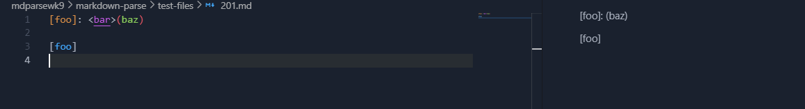
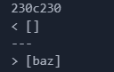
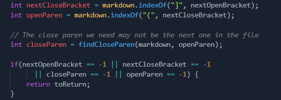
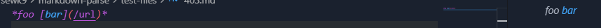
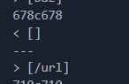
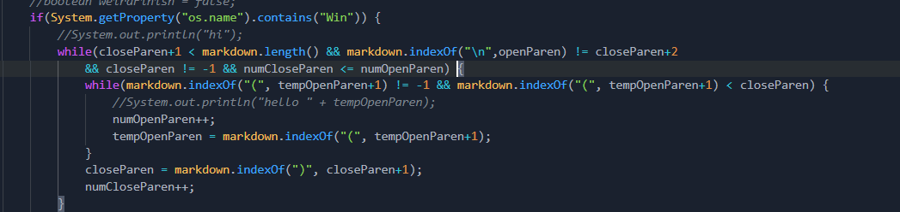

# Week 10 Lab Report by Daniel Lee

## How I found the tests with the different results

I used the script.sh bash script provided in the markdown parse repository to display the output of running markdown-parse for all the test files.

 I saved that output by using > filename after running the bash script for both my implementation of markdown-parse and the provided repo's implementation. 

 I then compared the two outputs and saved it into a file called differences.txt using the diff command.
```
diff my-markdown/markdown-parse/results.txt mdparsewk9/markdown-parse/results.txt > differences.txt
```
## The two different tests
I found two tests where my implementation's output differed from the given implementation's output.

### Test 1:
The first test was for test file 201.md. Here is the md file and its output in VSCode:



The markdown preview in VSCode did not recognize that there was a link in the test file.

Here are the differences:



What my implementation output was the top part, an empty list ([]). What the given implementation output was the url "baz" in the list.

I believe my implementation is correct for this test case because the markdown preview in VSCode did not recognize any links in the file. 

The bug in the given implementation's code is that it does not check for any sort of text before the parenthesis and after the brackets. As long as there exists a parenthesis after the brackets, it will output whatever there is in the parenthesis as a link.

To fix this bug the code below should be edited to include an if statement regarding the close bracket and open parenthesis.



The if statement could check if there exists a "<" or "<>" betwen the close bracket and open parenthesis. If so, then the string inside the parenthesis should not be counted as a link.

### Test 2:

The second test was for test file 403.md. Here is the md file and its output in VSCode:



The markdown preview in VSCode recognized that there was a link (/url) in the markdown file. 

Here are the differences between my implementation and the given implementation's output when given this file as an input:



My code outputs an empty empty list ([]) while the given implementation outputs a list including the link "\url" ([\url]). 

I believe that the given implementation is correct for this test, because the markdown preview in VSCode recognized there was a link with the \url as its URL. 

The bug in my code is that it checks for a new line right after the closing parenthesis and skips that line if the new line doesn't start right after the parenthesis.

The below code snippet is supposed to account for nested parenthesis within the link. I could edit it to account for non parenthesis characters after the closing parenthesis.

